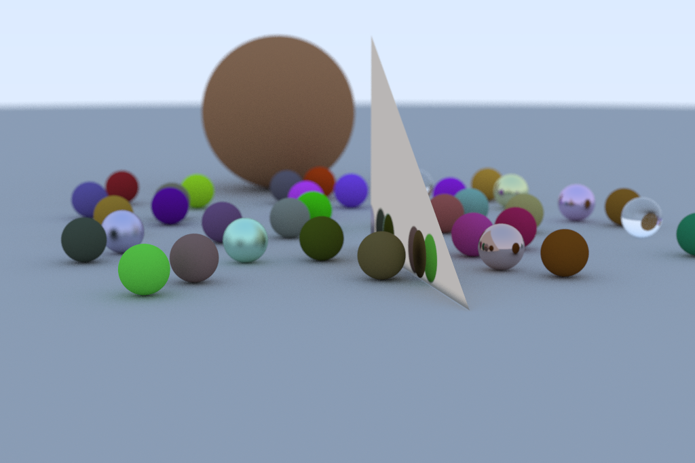
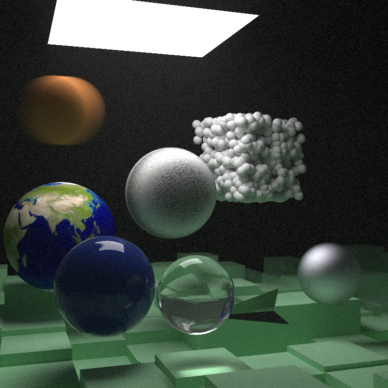

## "Offline" Path tracing rendering

###

## Third party library:
- [GLM](https://github.com/g-truc/glm)
- [stb_image/stb_image_write](https://github.com/nothings/stb)

### ***Reference:***
 - [_Ray Tracing in One Weekend_](https://raytracing.github.io/books/RayTracingInOneWeekend.html)
 - [_An Overview of the Ray-Tracing Rendering Technique_](https://www.scratchapixel.com/lessons/3d-basic-rendering/ray-tracing-overview)
 - [_Hughes, John F., et al. Computer graphics: principles and practice. Pearson education, 2014., chapter 16, 32_](https://cgpp.net/about.xml)